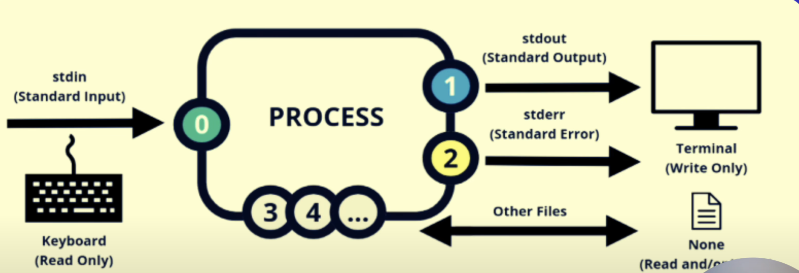

source: [here](https://youtu.be/lRokPC5ZrPU?si=ppQc1ZU0PUUKiuf1)

## Linux Redirection

- Merging Multiple files into a single file.
- Split a big file into a small file with relevant data

## Types of Redirection

- standard Input (stdin)
- standard output (stdout)
- standard error (stderr)

### File Descriptors

In Linux, a file descriptor is an integer that represents an open file. There are three standard file descriptors:

1. Standard Input (stdin): File descriptor 0
2. Standard Output (stdout): File descriptor 1
3. Standard Error (stderr): File descriptor 2

These descriptors help the system understand where to send or receive data.

  

### Output (stdout - 1)

- Output of a command is shown in terminal
- To route output in file using ```>``` : ```hostname > file_name```
- To append output in existing file using ```>>``` : ```pwd >> file_name```


### Error (stderr - 2)

If any command gives your error then it is considered as stderr -2  

We can redirect the error to a file:  
Ex: ```cd /root/ 2> error_file```  

To redirect both standard output and error to a file:
Ex: ```cd /root/ > error_file 2>&1```


